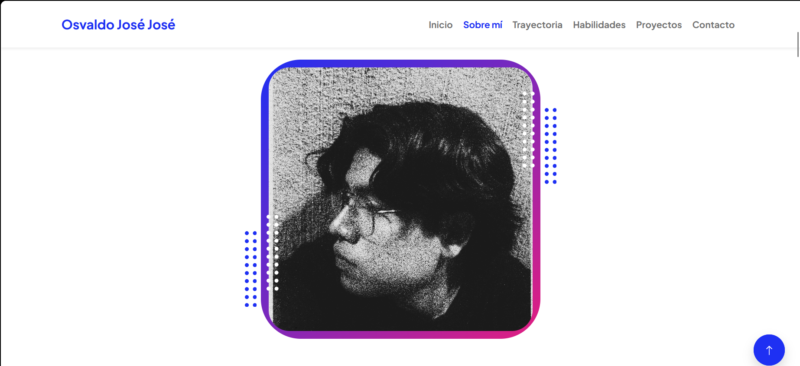
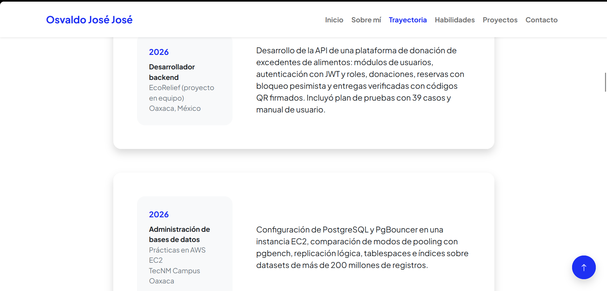
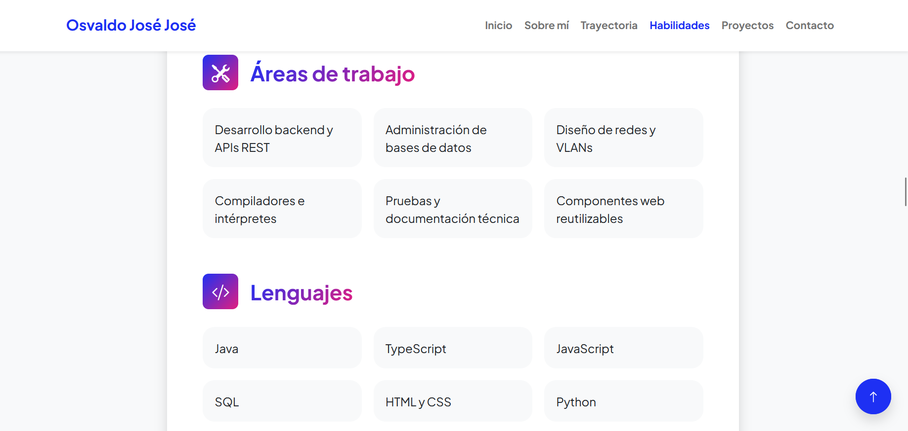
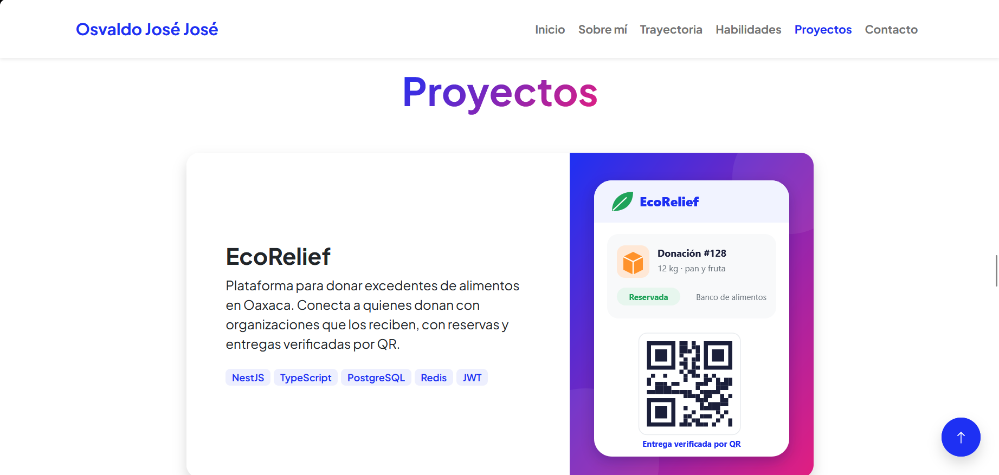
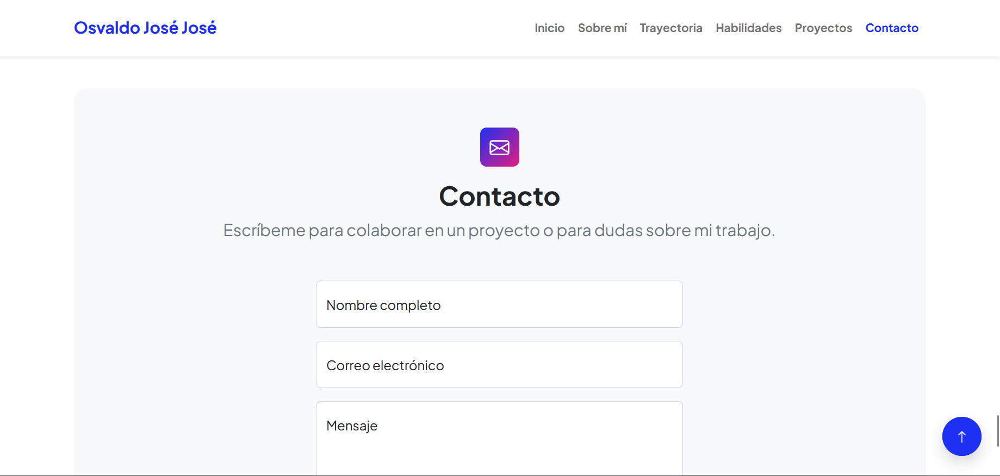
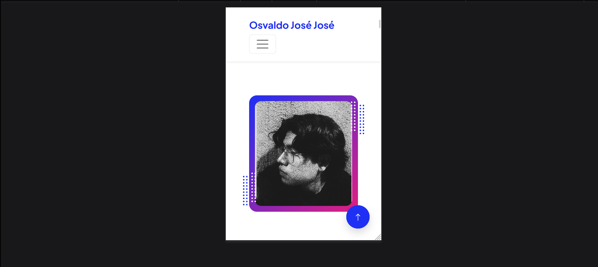

<div align="center">

# Portafolio Personal

**Osvaldo José José**
Ingeniería en Sistemas Computacionales · Instituto Tecnológico de Oaxaca (TecNM)



[Ver portafolio en vivo](https://josejose7520-dev.github.io/portafolio/) · [Repositorio](https://github.com/JoseJose7520-dev/portafolio)

</div>

Portafolio web de una sola página que presenta mi perfil, trayectoria, habilidades y proyectos académicos. Está construido con HTML, CSS y JavaScript sin frameworks de JS, a partir de una plantilla de Bootstrap, y se publica con GitHub Pages.

---

## Descripción del proyecto

### Framework y plantilla

| Elemento | Detalle |
|---|---|
| Framework CSS | **Bootstrap 5.2.3** (no se usa Tailwind) |
| Plantilla | **Personal**, de Start Bootstrap (versión 1.0.1, licencia MIT) |
| Descarga de la plantilla | https://startbootstrap.com/theme/personal |
| Código fuente de la plantilla | https://github.com/StartBootstrap/startbootstrap-personal |
| Íconos | Bootstrap Icons 1.8.1 (CDN) |
| Tipografía | Plus Jakarta Sans (Google Fonts), la misma de la plantilla |

### Estructura del repositorio

```
portafolio/
├── index.html            Página única con todas las secciones
├── README.md             Esta documentación
├── css/
│   └── portafolio.css    CSS de la plantilla (incluye Bootstrap) + estilos propios al final
├── js/
│   └── portafolio.js     Comportamiento del menú, botón "volver arriba" y formulario
└── img/
    ├── favicon.ico
    ├── perfil.jpg        Foto de perfil
    ├── proyecto-*.svg    Ilustraciones de cada proyecto
    └── capturas/         Capturas de pantalla usadas en este README
```

### Secciones del portafolio

El menú superior queda fijo al hacer scroll y cada opción lleva a una sección de la misma página. El enlace de la sección que se está viendo se resalta automáticamente.

**Inicio.** Encabezado con mi área de interés (backend, bases de datos y redes), una frase de presentación, dos botones (ver proyectos y contactarme) y mi foto de perfil dentro del recuadro con degradado de la plantilla.

**Sobre mí.** Párrafo breve con quién soy, qué estudio y hacia dónde quiero especializarme, más enlaces a mi GitHub y al formulario de contacto.

**Trayectoria.** Tarjetas con mi experiencia en proyectos (desarrollo backend en EcoRelief y administración de bases de datos en AWS) y mi formación en el Instituto Tecnológico de Oaxaca. Incluye un botón que lleva a mi perfil de GitHub.

**Habilidades.** Tres grupos: áreas de trabajo, lenguajes de programación y herramientas (PostgreSQL, NestJS, Docker, AWS, Packet Tracer, Git).

**Proyectos.** Cinco tarjetas con nombre, descripción, tecnologías usadas e ilustración: EcoRelief, Solosis, PasosJS, Red de videovigilancia IP y PostgreSQL en AWS. Debajo hay una franja con una invitación a contactarme.

**Contacto.** Formulario con nombre, correo y mensaje. Valida los campos con JavaScript y, al enviarlo, abre la aplicación de correo con el mensaje ya redactado.

**Pie de página.** Año actual (se calcula con JS) y crédito a la plantilla original.

---

## Proceso de creación

**1. Elección y descarga de la plantilla.** Revisé plantillas gratuitas de Start Bootstrap y elegí *Personal* porque ya incluía las secciones que pide la actividad (presentación, currículum, habilidades, proyectos y contacto), usa Bootstrap 5 y tiene licencia MIT. La descargué desde el botón *Free Download* de su página.

**2. Análisis de la estructura original.** La plantilla venía dividida en cuatro páginas (`index.html`, `resume.html`, `projects.html` y `contact.html`), con los archivos en `assets/`, `css/styles.css` y `js/scripts.js`. Noté tres cosas que había que cambiar: los nombres de archivos y carpetas no coincidían con los del entregable, el `scripts.js` estaba vacío, y el formulario de contacto dependía de un servicio externo (SB Forms) que necesita un token de pago para funcionar.

**3. Reorganización de archivos.** Renombré `css/styles.css` a `css/portafolio.css`, la carpeta `assets/` a `img/`, y creé `js/portafolio.js`. Actualicé todas las rutas en el HTML. El archivo CSS se conservó completo porque la plantilla compila Bootstrap junto con sus propios colores y componentes en un solo archivo; separar Bootstrap habría roto el diseño original.

**4. Fusión en una sola página.** Uní el contenido de las cuatro páginas en `index.html` y cambié los enlaces del menú (`resume.html`, `projects.html`...) por anclas internas (`#trayectoria`, `#proyectos`...). Lo hice para cumplir con la estructura del entregable y porque una página única se navega más rápido en un portafolio corto. También agregué al menú las secciones *Sobre mí* y *Habilidades*, que antes no tenían acceso directo, y lo dejé fijo arriba (`sticky-top`).

**5. Traducción y contenido real.** Traduje toda la interfaz al español y reemplacé los textos de ejemplo (*Lorem ipsum*, *Stark Industries*, etc.) con mi información y mis proyectos académicos reales. Cambié el idioma del documento a `lang="es"` y agregué descripción y autor en las etiquetas `meta`.

**6. Sección de habilidades ampliada.** La plantilla traía dos grupos (*Professional Skills* y *Languages*). Agregué un tercero, *Herramientas*, reutilizando el mismo diseño de tarjetas, porque buena parte de lo que sé hacer son tecnologías concretas que no son lenguajes.

**7. Proyectos con imágenes locales.** Las tarjetas originales cargaban imágenes de relleno desde `dummyimage.com`. Las sustituí por ilustraciones SVG propias guardadas en `img/`, para no depender de un sitio externo. Agregué etiquetas con las tecnologías de cada proyecto y oculté la imagen en pantallas pequeñas, porque en celular aplastaba el texto.

**8. Foto de perfil.** La plantilla está diseñada para una foto recortada sin fondo que sobresale del recuadro. Para usar una foto formal normal, creé la clase `.foto-recuadro` en `portafolio.css`, que la ajusta dentro del recuadro con degradado sin deformarla y deja visible el marco de color.

**9. Formulario de contacto propio.** Quité el script de SB Forms y escribí la validación en `portafolio.js` usando las clases de Bootstrap `is-valid` e `is-invalid`. Al enviar, el formulario abre el correo del visitante con `mailto:`, lo cual funciona en GitHub Pages porque no necesita servidor. Agregué un contador de caracteres para el mensaje.

**10. Interacciones en JavaScript.** En `portafolio.js` agregué: resaltado del enlace del menú según la sección visible (con `IntersectionObserver`), cierre automático del menú en celulares al elegir una opción, botón flotante para volver arriba y año automático en el pie de página.

**11. Estilos propios.** Todos los estilos agregados están al final de `portafolio.css` bajo el comentario *ESTILOS PERSONALIZADOS DEL PORTAFOLIO*: compensación de la barra fija al navegar, enlace activo, marco de la foto, etiquetas de tecnologías, efecto al pasar el mouse en proyectos, botón para volver arriba y soporte para usuarios que desactivan animaciones.

**12. Publicación.** Subí el proyecto a un repositorio público en GitHub y activé GitHub Pages desde *Settings → Pages*, con la rama `main` y la carpeta raíz.

---

## Capturas de pantalla

### Inicio


### Sobre mí y trayectoria


### Habilidades


### Proyectos


### Contacto con validación


### Vista en celular


---

## Créditos

Plantilla [Personal](https://startbootstrap.com/theme/personal) de Start Bootstrap, publicada bajo licencia MIT. Contenido, fotografía, ilustraciones de proyectos y JavaScript propios.
